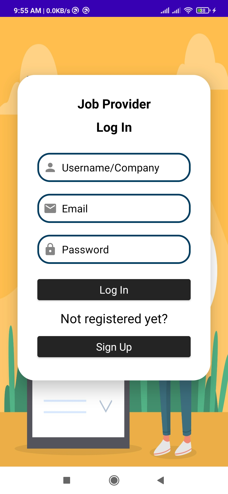
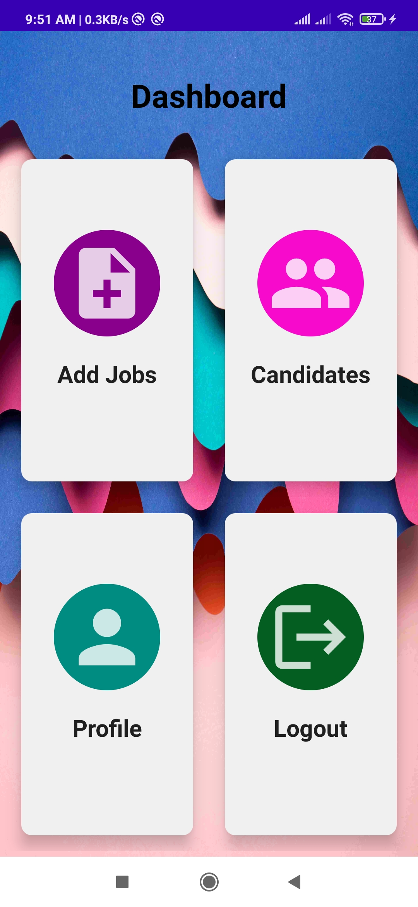
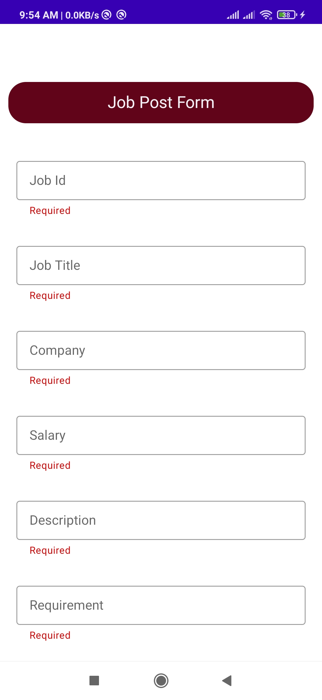
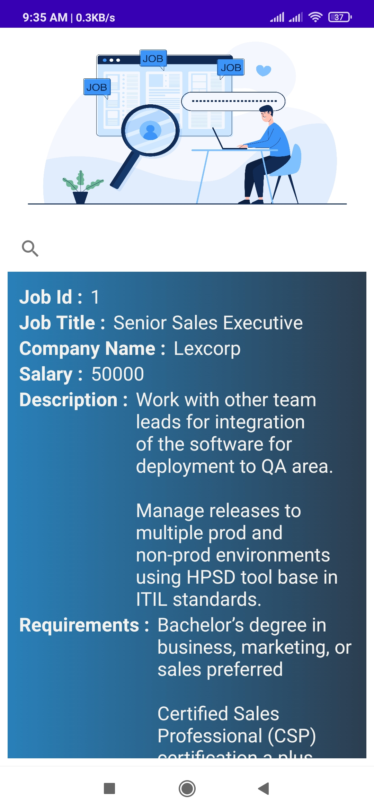
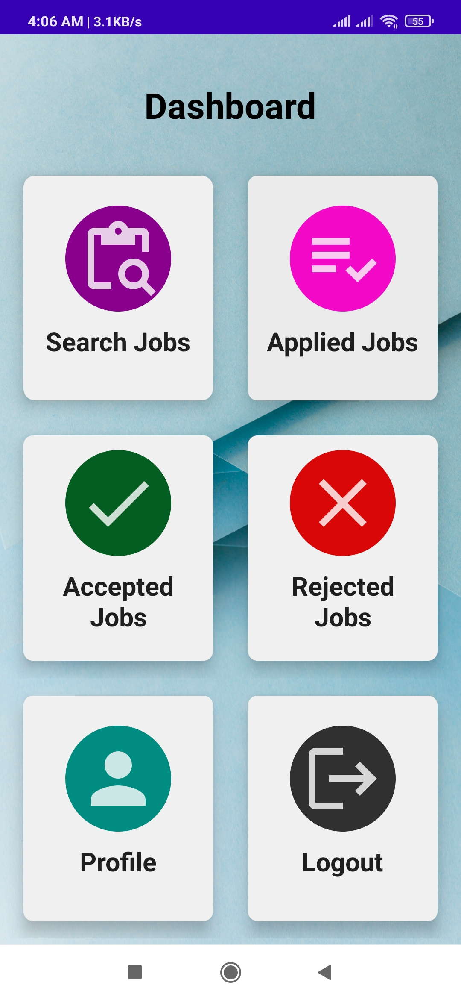
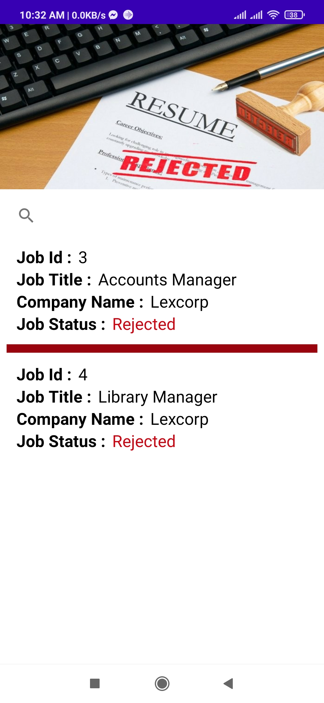
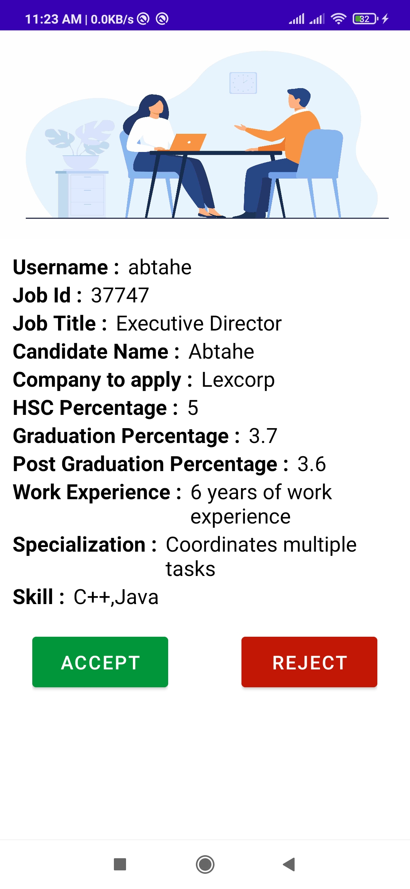

<h1> Job Portal Android App</h1>

<h2> Description</h2>

  The <strong>Job Portal Android App</strong> is a mobile application designed to connect job seekers with employers. 
  It simplifies the hiring process by providing features such as job postings, search filters, application tracking, 
  and real-time notifications, offering a seamless experience for both parties.

<h2>Features</h2>
<ul>
  <li><strong>User Authentication</strong>: Secure login and registration for job seekers and employers.</li>
  <li><strong>Job Posting</strong>: Employers can post job listings with detailed descriptions and requirements.</li>
  <li><strong>Job Search</strong>: Advanced filters to search jobs by title, location, category, salary, and more.</li>
  <li><strong>Application Management</strong>: Track applications and job statuses.</li>
  <li><strong>Real-Time Notifications</strong>: Stay updated with job recommendations, application status, and new postings.</li>
  <li><strong>User Profiles</strong>:
    <ul>
      <li>Job seekers can create and update resumes and profiles.</li>
      <li>Employers can showcase company profiles.</li>
    </ul>
  </li>
  <li><strong>Saved Jobs</strong>: Save jobs to apply later.</li>
  <li><strong>Chat Functionality</strong>: Direct communication between employers and job seekers.</li>
</ul>

<h2> Screenshots</h2>

  
  
  

  
  
 

   
  
  

  
  
  

  
  
  
  

</body>
</html>
